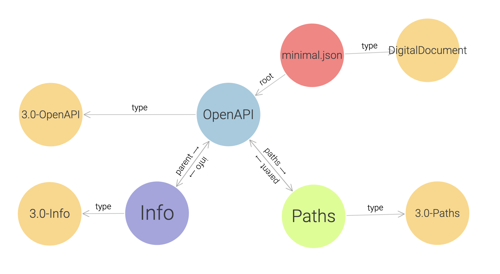

# OpenAPI Compliance

This repository contains the OpenAPI Compliance Project, the first
piece of which is the OpenAPI Specification Compliance Parser.

The OAS Compliance Parser is expected to reach 1.0 status by
late 2023.  The current status of the project is
[pre-Milestone 1](https://tinyurl.com/4kth84k8).

Currently, only OAS 3.0 is supported, although OAS 3.1 support is planned.

## Requirements and Installation

`oascomply` is a Python package with several command-line interfaces:

* `oascomply` parses and validates OAS 3.x API descriptions
* `yaml-to-json` does what it says, as converting a YAML API description
  to JSON will result in
  [substantial performance improvements](https://github.com/handrews/oasparser/issues/9) if running `oascomply` on the same document repeatedly
* `patch-oas-schemas` is used by package maintainers to update the modified
  OAS 3.x JSON Schemas used by `oascomply`

`oascomply` requires Python 3.8 or later, and must be checked out from GitHub
and installed using [`poetry`](https://python-poetry.org/docs/).  See the
[Installation Guide](INSTALL.md) for more detailed instructions.

## Usage: Parsing API descriptions

API descriptions consist of one or more documents.

A single, self-contained document can be validated like this:

```
~/src/oascomply % oascomply -f tutorial/minimal.json
Your API description is valid!
```

### Multi-document API descriptions

For a multi-document API description where the files have file extensions
(`schemas/foo.json`) but the references do not (`"$ref": "schemas/foo"`),
we need to make a distinction between two concepts for each document:

* its _**URL**_ (for local files, the `file:` URL from which it was read)
* its _**URI**_ (the identifier used to resolve references and in the parsed graph discussed further down)

By default, `oascomply` assumes that the URI is the same as the URL.
If we try that default behavior with our referencing exampe, it won't work:

```
~/src/oascomply % oascomply -f tutorial/references/openapi.json -f tutorial/references/pathitems/foo.json -f tutorial/references/schemas/bar.json
ERROR:oascomply.oas30dialect:FOUND: file:///Users/handrews/src/oascomply/tutorial/references/schemas/bar
ERROR:oascomply.apidescription:Reference without suffix attempted despite target resource being registered under a URI with suffix

The above error can be fixed either by using -x:

	-x -f tutorial/references/schemas/bar.json

... or by using the two-argument form of -f:

	-f tutorial/references/schemas/bar.json file:///Users/handrews/src/oascomply/tutorial/references/schemas/bar
```

Let's try the `-x` option, which creates URIs by just stripping the suffix off, since that's a common pattern:

```
~/src/oascomply % oascomply -x -f tutorial/references/openapi.json -f tutorial/references/pathitems/foo.json -f tutorial/references/schemas/bar.json
ERROR:oascomply.apidescription:JSON Schema documents must pass "Schema" (without quotes) as an additional -f argument:

	 -x -f tutorial/references/schemas/bar.json Schema
```

OK, we're closer.  This example has a standalone schema file, and for Reasons™
(meaning that the author ran out of time to fix it before this milestone),
`oascomply` gets a bit confused.  But at least it tells you how to fix it!
So let's try that:

```
~/src/oascomply % oascomply -x -f tutorial/references/openapi.json -f tutorial/references/pathitems/foo.json -f tutorial/references/schemas/bar.json Schema
Your API description is valid!
```

### Verbose validation and nicer URIs

Now it works!  But as you can see in the errors from earlier, the URI is just
a `file:` URL with the `.json` chopped off, which is... kinda misleading.
The reason API description authors usually leave off the `.json` or `.yaml`
is because the documents will be made available over HTTPS, and the JSON
vs YAML format will be handled in content negotiation.  We can assign
`https:` URIs instead of `file:` ones (but the URLs will always be `file:`
URLs, at least until support for validating remote descriptions is added).

The simplest way to do that is to put the URI after the file as part
of the `-f` option.  Let's also increase the verbosity by passing `-v`,
which will show us the URIs without needing to provoke an error message:

```
~/src/oascomply % oascomply -f tutorial/minimal.json https://example.com/minimal -v
INFO:oascomply.apidescription:Adding document "tutorial/minimal.json" ...
INFO:oascomply.apidescription:...URL <file:///Users/handrews/src/oascomply/tutorial/minimal.json>
INFO:oascomply.apidescription:...URI <https://example.com/minimal>
INFO:oascomply.apidescription:...instantiating OAS Document <https://example.com/minimal>
INFO:oascomply.apidescription:Checking JSON Schema references in <https://example.com/minimal#>...
INFO:oascomply.apidescription:...resolving with OasJson.resolve_references()
Your API description is valid!
```

Here we get some information, including how URLs and URIs are associated.

Setting the URI for each file like that is fine when you only have one file,
but it can get annoying with more.  The `-d` option lets you associate
a directory with a URI prefix.  `oascomply` will replace the directory with
the prefix to create the URI, and strip off any file extension automatically.
There is no need to pass `-x` with `-d`, and the format is similar to `-f` —
first the filesystem path, then the URI (or URI prefix in this case):

```
~/src/oascomply % oascomply -d tutorial/references https://example.com -f tutorial/references/openapi.json -f tutorial/references/pathitems/foo.json -f tutorial/references/schemas/bar.json Schema -v
ERROR:oascomply.apidescription:URI prefixes must include a path that ends with '/': <tutorial/references>
```

Oops!  URI prefixes need to end with a `/` to match the directory, otherwise
the behavior gets a little confusing.  But that's easily fixed:

```
~/src/oascomply % oascomply -d tutorial/references https://example.com/ -f tutorial/references/openapi.json -f tutorial/references/pathitems/foo.json -f tutorial/references/schemas/bar.json Schema -v
INFO:oascomply.apidescription:Adding document "tutorial/references/openapi.json" ...
INFO:oascomply.apidescription:...URL <file:///Users/handrews/src/oascomply/tutorial/references/openapi.json>
INFO:oascomply.apidescription:...URI <https://example.com/openapi>
INFO:oascomply.apidescription:...instantiating OAS Document <https://example.com/openapi>
INFO:oascomply.apidescription:Adding document "tutorial/references/pathitems/foo.json" ...
INFO:oascomply.apidescription:...URL <file:///Users/handrews/src/oascomply/tutorial/references/pathitems/foo.json>
INFO:oascomply.apidescription:...URI <https://example.com/pathitems/foo>
INFO:oascomply.apidescription:...instantiating OAS Document <https://example.com/pathitems/foo>
INFO:oascomply.apidescription:Adding document "tutorial/references/schemas/bar.json" ...
INFO:oascomply.apidescription:...URL <file:///Users/handrews/src/oascomply/tutorial/references/schemas/bar.json>
INFO:oascomply.apidescription:...URI <https://example.com/schemas/bar>
INFO:oascomply.apidescription:...instantiating JSON Schema <https://example.com/schemas/bar>
INFO:oascomply.apidescription:Checking JSON Schema references in <https://example.com/openapi#>...
INFO:oascomply.apidescription:...resolving with OasJson.resolve_references()
INFO:oascomply.apidescription:Checking JSON Schema references in <https://example.com/pathitems/foo#>...
INFO:oascomply.apidescription:...resolving with OasJson.resolve_references()
INFO:oascomply.apidescription:Checking JSON Schema references in <https://example.com/schemas/bar>...
INFO:oascomply.apidescription:...already resolved by jschon.JSONSchema()
INFO:oascomply.oasgraph:Validating "example" https://example.com/openapi#/example against schema https://example.com/openapi#/components/responses/foo/content/application~1json/schema, metaschema https://spec.openapis.org/oas/v3.0/dialect/base
INFO:oascomply.oasgraph:Validating "example" https://example.com/schemas/bar#/example against schema https://example.com/schemas/bar, metaschema https://spec.openapis.org/oas/v3.0/dialect/base
INFO:oascomply.oasgraph:Validating "default" https://example.com/schemas/bar#/default against schema https://example.com/schemas/bar, metaschema https://spec.openapis.org/oas/v3.0/dialect/base
INFO:oascomply.oasgraph:Validating "example" https://example.com/openapi#/example against schema https://example.com/openapi#/components/responses/foo/content/application~1json/schema, metaschema https://spec.openapis.org/oas/v3.0/dialect/base
Your API description is valid!
```

This multi-document example also uses the `example` and `default` keywords, so we get informed that the values of those keywords are being validated against their schemas.  This validation supports OAS 3.0-specific keywords like `nullable`, and also validates some `format`s (currently only certain string formats, but more will be added).  Validation of examples and defaults can be disabled by passing `-e false`.

_**TODO:** by May 25 - show examples with errors and discuss error output.  Two ways to provoke an error are to have an example that is invalid according to its schema, and to have a reference (Reference Object, `$ref` in a Path Item Object, or `operationRef` in a Link Object) that references the wrong type of object.  If the wrong object is in the same file, this will cause an error in semantic validation.  Sometimes if it references a wrong object in another file, that will be caught during JSON Schema validation instead._

## Displaying the parsed graph

That's nice, but what else does this tool do?  It constructs an
RDF (Resource Description Framework 1.1) graph out of the API description.
This is somewhat analogous to how compilers parse programming languages
into an abstract syntax tree.  Don't worry, you don't need to go read
the RDF spec (or the endless number of related semantic web specs) to
benefit from this graph!

We need to build a graph rather than a tree in order to show how references
connect different pieces of the description documents.  In later milestones
we will also use this graph to do much more sophisticated validation.

There are many ways to write an RDF graph to a file, and `oascomply` can
produce any of the ones supported by the Pyton `rdflib` package.  But the
default, which you get by passing `-o` without an argument, is a simple
line-oriented format known as
[N-Triples 1.1](https://www.w3.org/TR/n-triples/).  It is supported by
most RDF-bsaed tools, but is also simple enough to be parsed directly.

_TODO: by May 25 – simple regex-based parsing tool to render a more human-friendly version of the NT output._

To print the graph to stdout, use the `-o` option without an argument
(diagnostic messages such as "Your API description is valid!" are printed
to stderr).  We'll set a short HTTPS URI as it's less noisy than full
fileystem paths.

```
~/src/oascomply % oascomply -f tutorial/minimal.json https://example.com/minimal -o
<https://example.com/minimal#> <https://spec.openapis.org/compliance/ontology#paths> <https://example.com/minimal#/paths> .
<https://example.com/minimal#/info> <http://www.w3.org/2000/01/rdf-schema#label> "Info" .
<https://example.com/minimal> <http://www.w3.org/2000/01/rdf-schema#label> "minimal.json" .
<https://example.com/minimal> <https://spec.openapis.org/compliance/ontology#locatedAt> "file:///Users/handrews/src/oascomply/tutorial/minimal.json"^^<http://www.w3.org/2001/XMLSchema#anyURI> .
<https://example.com/minimal> <https://spec.openapis.org/compliance/ontology#root> <https://example.com/minimal#> .
<https://example.com/minimal#/info> <https://spec.openapis.org/compliance/ontology#allowsExtensions> "true"^^<http://www.w3.org/2001/XMLSchema#boolean> .
<https://example.com/minimal#/info> <https://spec.openapis.org/compliance/ontology#parent> <https://example.com/minimal#> .
<https://example.com/minimal#/info> <https://spec.openapis.org/compliance/ontology#title> "Minimal OAS 3.0 description" .
<https://example.com/minimal#/info> <http://www.w3.org/1999/02/22-rdf-syntax-ns#type> <https://spec.openapis.org/compliance/ontology#3.0-Info> .
<https://example.com/minimal#> <https://spec.openapis.org/compliance/ontology#allowsExtensions> "true"^^<http://www.w3.org/2001/XMLSchema#boolean> .
<https://example.com/minimal#/paths> <http://www.w3.org/2000/01/rdf-schema#label> "Paths" .
<https://example.com/minimal#/paths> <https://spec.openapis.org/compliance/ontology#allowsExtensions> "true"^^<http://www.w3.org/2001/XMLSchema#boolean> .
<https://example.com/minimal#/info> <https://spec.openapis.org/compliance/ontology#apiDescriptionVersion> "1.0.0" .
<https://example.com/minimal> <http://www.w3.org/1999/02/22-rdf-syntax-ns#type> <https://schema.org/DigitalDocument> .
<https://example.com/minimal#> <http://www.w3.org/2000/01/rdf-schema#label> "OpenAPI" .
<https://example.com/minimal#/paths> <https://spec.openapis.org/compliance/ontology#parent> <https://example.com/minimal#> .
<https://example.com/minimal#> <https://spec.openapis.org/compliance/ontology#info> <https://example.com/minimal#/info> .
<https://example.com/minimal#> <http://www.w3.org/1999/02/22-rdf-syntax-ns#type> <https://spec.openapis.org/compliance/ontology#3.0-OpenAPI> .
<https://example.com/minimal#/paths> <http://www.w3.org/1999/02/22-rdf-syntax-ns#type> <https://spec.openapis.org/compliance/ontology#3.0-Paths> .
<https://example.com/minimal#> <https://spec.openapis.org/compliance/ontology#oasVersion> "3.0.3" .
Your API description is valid!
```

## Reading the output

That may look like a bit of a mess, but it's really pretty straightforward.
Each line represents an edge connecting two nodes in the graph:

* Concepts, including data types, relationships, OAS object types (Path Item Object, Schema Object, etc.), and the actual typed objects from your API description, are represented by URIs in angle brackets.
* Literal values, such as OAS object properties from your API description, are quoted strings.
* Literals with a data type other than a plain string are followed by `^^` and a URI in angle brackets indicating the type.

Edges are unidirectional, from the concept on the left (the _subject_)
to the concept or literal on the right (the _object_).  The URI in the
middle is called the _predicate_, and describes the relationship
represented by the edge (I'll just call it the _relationship_ from here on).

This will likely make more sense with a picture.
Here is an image showing the exact data displayed above:



This visualization does not show the literal values (the tool used to
generate it shows them in a side panel when you click on a node).

### Line by line

Every N-Triples line looks like one of the following three structures:[^lang]

```
<subject concept> <relationship> <object concept> .
<subject concept> <relationship> "string literal value" .
<subject concept> <relationship> "literal value"^^<data type> .
```

The `.` terminates the line, and is mostly there to make this format
a valid subset of several more complex formats.

Since the same node can appear in either the subject or object position in
many triples, these lines in the output connect through shared nodes to form
a graph:

```
<a> <x> <b>
<b> <y> <c>
<a> <z> "d"
```

This is a graph with three nodes, `<a>`, `<b>`, and `<c>`, with edges
`<x>` connecting `<a>` to `<b>`, and `<y>` connecting `<b>` to `<c>`.
Node `<a>` is also connected to a literal string "d" by edge `<z>`.[^prop]

### Seeing through the URI clutter

RDF-aware tools are good at making use of the full URIs behind the scenes,
but if you're reading the output directly, it's a bit much.

In most cases, the absolute URI (the part before the `#`) serves as
a namespace, and the URI fragment (the part after the `#`)
identifies a specific thing within that namespace.

Here are the namespaces you will see in in `oascomply` output
in addition to the URI (which is by default the `file:` URL for local files)
of your own document.  It is typical to include the trailing `#` as part of
the namespace.[^namespaces]

First, the namespaces defined outside of OpenAPI:

* `http://www.w3.org/2001/XMLSchema#` – XSD, which is used for its datatype definitions; no actual understanding of XML Schema is required!
* `http://www.w3.org/1999/02/22-rdf-syntax-ns#` – RDF, which defines fundamental concepts and relationships such as the `type` relationship; you will notice this relationship connecting locations in your file to their OAS Object types
* `http://www.w3.org/2000/01/rdf-schema#` – RDFS (RDF Schema), which includes a few more fairly fundamental concepts and relationships; the distinction between RDF and RDFS is not very important here, and `oascomply` mostly just uses the `label` relationship which informs tools how to display nodes for humans
* `https://schema.org/` – Schema.org defines many common concepts; currently `oascomply` just uses the "DigitalDocument" concept (note that values in this namespace are part of the URI path, not the fragment)

OpenAPI concepts use the following namespace:

* `https://spec.openapis.org/compliance/ontology#`

For OpenAPI object types, a version prefix, e.g. `3.0-Schema`, is part of the fragment.  For relationships, including object fields with string, number, or boolean values, there is no version prefix.  _(This may not remain the case, it will depend on feedback).

-----

[^namespaces]: In more complex RDF formats, namespaces are displayed
as short names that substitute for a URI prefix (technically an IRI
prefix, but that just means URI with unicode support).  You can see
this by passing `-o ttl` which produces the relatively human-readable
Turtle format.  It will include things like `rdfs:label` in place of
`<http://www.w3.org/2000/01/rdf-schema#label>`.  Unfortunately, when
using these short prefixes, many characters used in JSON Pointer
fragments, including `/` and `$`, are not allowed.  This means most URIs
for your API description end up written out in full, making the prefix
concept less useful than it really should be.  N-Triples was selected
in part to avoid confusion around this.

[^lang]: There is a fourth structure used for language-tagged strings, but
`oascomply` is not currenlty aware of what (human, not programming) language
an API description uses, so this structure does not appear in the output.

[^prop]: If you are familiar with property graphs, which are another type of
graph database, literal nodes are roughly equivalent to properties
in property graphs (although RDF refers to all edges as properties).
